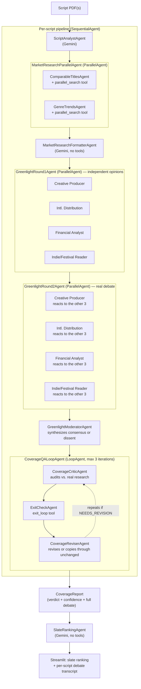

# ScriptGuard AI

Multi-agent system that simulates a studio **greenlight committee** — 4 persona agents
with real industry biases (creative, international distribution, financial,
indie/festival) that analyze a script, **debate each other over 2 rounds**, and a
moderator synthesizes the verdict — combined with real parallel market research,
self-audited quality control, and prioritization of a full slate of scripts (not just
one at a time).

Built for the **Agentic Cinema: The Blockbuster Hackathon** (Google Cloud, Parallel track).

## Project status

**Functional end-to-end and validated with the real API** (Gemini + Parallel Search), not
just "it compiles":

- Individual script of 4 pages (~420 words): **35 seconds**, coherent verdict.
- Slate of 3 scripts of 4 pages each: **1 minute 22 seconds** total — 3 full 16-agent
  pipelines plus the slate-ranking agent, roughly 27 seconds per script.

Both figures come from real runs against the live APIs (Gemini + Parallel Search). Every
measured run so far uses 4-page scripts; see [Known limitations](#known-limitations-honesty-first)
for what that does and doesn't tell you about feature-length material.

**Submission-ready:** the repo is public on GitHub with the license visible in "About",
the app is deployed with a public URL (Streamlit Community Cloud), and the demo video has
been recorded.

## Why this isn't just another report generator

The first version of this project was a 4-step `SequentialAgent` producing a report with
a single generic verdict — functional, but indistinguishable from any other "AI script
coverage" tool someone else might build for this same hackathon. It was redesigned twice:

- **Parallel market research** (`ParallelAgent`): two agents with real access to
  Parallel's Search API research box-office comparables and genre trends
  **concurrently**, not in a single sequential call.
- **A Greenlight Committee that actually debates** (`ParallelAgent` x2 + synthesis):
  instead of a single orchestrator that "decides," 4 persona agents (Creative Producer,
  International Distribution, Financial Analyst, Indie/Festival Reader) give their
  initial opinion independently and then **react to each other's arguments** in a second
  round — each can change position if another's argument convinces them, or reinforce
  their own by responding to the strongest objection. The Moderator synthesizes the final
  verdict reflecting the debate's real outcome (consensus or explicit dissent), not an
  average.
- **Self-critique and revision** (`LoopAgent`): a QA agent audits every claim in the
  coverage against the real research (it doesn't blindly trust what the previous LLM
  generated) and, if it finds unsupported figures or trends, triggers an automatic
  revision of the report before it ships. The loop closes on its own once the report is
  approved (or a max iteration count is reached).
- **Slate prioritization**: you can upload several scripts at once. Each goes through its
  own greenlight committee, and then a "Head of Acquisitions" agent prioritizes them as a
  portfolio (genre diversification, repeated-comparables risk, budget balance) — the real
  use case of an acquisitions team, not an isolated read.

## Architecture

Inside `MarketResearchParallelAgent`, the two research agents (`ComparableTitlesAgent`
and `GenreTrendsAgent`) run **concurrently**, not one after the other.



All research/committee/formatting agents use **Gemini** via `google-genai`, orchestrated
with **Google ADK** (17 agents in total, coordinated through 1 `SequentialAgent` + 3
`ParallelAgent` + 1 `LoopAgent`). Research uses the **official Parallel SDK**
(`parallel-web`) as a real tool invoked at runtime.

> Technical note 1: ADK doesn't reliably support combining `tools` + structured output
> (`output_schema`) on the same `LlmAgent` except with Gemini 3.0, so agents with tools
> write free text and a separate formatter agent (no tools) converts it to
> Pydantic-validated JSON.

> Technical note 2: on Windows, `pipeline.py` reuses a single asyncio event loop across
> every run in the process (every Streamlit click) instead of creating and closing a new
> one per call — repeatedly closing/reopening the loop triggered a cosmetic traceback
> ("Fatal error on SSL transport") when destroying async HTTP clients mid-use. Verified
> without that traceback after 2+ consecutive runs in the same process.

## Interface

The UI is a deliberately designed "greenlight room" rather than default Streamlit: a dark
palette (`#0B0E14` ground, muted gold `#C9A227` accent), Playfair Display for headings and
Inter for body copy, and a single card system reused across every section — so no part of
the coverage reads as an undifferentiated wall of text.

- **Verdicts** are pill badges instead of coloured text: RECOMMEND / CONSIDER / PASS as a
  filled pill, confidence as an outlined one, so the two are distinguishable at a glance.
- **The committee debate** — the product's actual differentiator — gives each persona a
  card whose left border carries their final verdict lean, with round 1 and round 2 side
  by side and explicit `Changed position` / `Dissenting` tags.
- **Strengths, weaknesses, market research and the narrative breakdown** all use the same
  panel system, colour-coded green/red/gold by meaning, with acts, characters and
  comparable titles as their own sub-cards.
- **Responsive**: the stage grid reflows 4 → 2×2 → 1 column, and the debate's two rounds
  stack vertically (the connector arrow turning from → to ↓) on narrow screens. Verified
  with automated screenshots and overflow checks at 1440 / 1100 / 900 / 768 / 480 / 375 px.

Two implementation details worth knowing if you fork this:

> Technical note 3: the injected CSS does not rely on `.streamlit/config.toml` alone. That
> file is only picked up when Streamlit runs with the project as the working directory, and
> without it the dark cards would otherwise land on a white page — so the stylesheet paints
> the app background, header and buttons itself.

> Technical note 4: agent- and script-generated text is escaped with `html.escape()` before
> being interpolated into the raw HTML blocks (`esc_html()` in `app.py`). Script text is
> untrusted input — a stray `<` would break the markup, and tags in a screenplay would
> otherwise be injected into the page. Agent-supplied source URLs are only turned into
> links when they are `http(s)`.

## Known limitations (honesty first)

- The QA agent audits **internal consistency** (is the figure in the coverage backed by
  the research collected?), it doesn't do additional external fact-checking of those
  figures — it trusts that Parallel's Search API returned real data.
- The slate ranking is only as good as the individual coverage of each script feeding it;
  it doesn't recompute additional research at the portfolio level.
- The committee debate has exactly 2 fixed rounds (independent + reaction), not a
  variable number of rounds until consensus — a deliberate decision so behavior stays
  deterministic and testable instead of an open-ended loop. Both rounds always run,
  whether or not the 4 members agree.
- Cost/time scales linearly with the number of scripts in the slate: each additional
  script adds roughly 27 seconds, 16 Gemini calls, and 2 to 6 real Parallel searches, so a
  full 3-script slate takes around a minute and a half.
- **Only benchmarked on 4-page scripts.** The pipeline has not been run on a full
  feature-length screenplay (~100 pages), because doing so burns a large amount of tokens
  on a paid key for a demo. By construction only the `ScriptAnalystAgent` receives the
  script's full text — the other 15 agents work on the already-summarized analysis — so
  runtime should grow far more slowly than script length, and the analyst's input stays
  well inside Gemini's context window. Both of those are properties of the design,
  not measured results: treat feature-length behaviour as untested.
- Max 3 scripts per run and a hard cap of 5 runs per hour (app-wide, not per user) — a
  deliberate cost-control guardrail for a publicly-hosted demo, not a technical ceiling of
  the pipeline itself.
- No "demo mode" without API keys: running the project requires your own Gemini and
  Parallel keys with active billing.

## Requirements

- Python 3.11+ (also tested on 3.10)
- A Gemini API key (`GOOGLE_API_KEY`) — works with an AI Studio key or one generated from
  Google Cloud Console with billing enabled (recommended, avoids 429s from the free tier)
- A Parallel API key (`PARALLEL_API_KEY`) — https://platform.parallel.ai

## Installation

```bash
git clone <this-repo-url>
cd "ScriptGuard AI"
python -m venv .venv
.venv\Scripts\activate        # Windows
# source .venv/bin/activate   # macOS/Linux

pip install -r requirements.txt
```

Set up your API keys:

```bash
copy .env.example .env         # Windows
# cp .env.example .env         # macOS/Linux
```

Edit `.env` and fill in:

```
GOOGLE_API_KEY=your_gemini_api_key
PARALLEL_API_KEY=your_parallel_api_key
```

## Running it

```bash
streamlit run app.py
```

Open the URL Streamlit shows in your browser (`http://localhost:8501` by default), upload
one or more PDF scripts (a full slate if you have several) and click **Generate slate
coverage**. Each script runs its own 16-agent pipeline (plus the slate-ranking agent at
the end); on the 4-page scripts tested so far, a single script takes ~35 seconds and a
slate of 3 took 1 minute 22 seconds (see [Project status](#project-status)).

No script on hand? Click **Try with a sample script** to run the pipeline on a bundled
script (`sample_scripts/cold_storage_sample.pdf`) with no upload needed — the **Download
sample script (PDF)** button above lets you grab that same file to see exactly what gets
analyzed before running it. This still counts as a real run against the app's rate limit
(see below).

## Project structure

```
ScriptGuard AI/
├── app.py                              # Streamlit interface (slate + individual coverage) + UI theme CSS
├── .streamlit/
│   └── config.toml                     # Dark base theme so native widgets match the custom CSS
├── requirements.txt
├── .env.example
├── sample_scripts/
│   └── cold_storage_sample.pdf         # Bundled sample for the "Try with a sample script" button
├── scriptguard/
│   ├── schemas.py                      # Pydantic: ScriptAnalysis, MarketResearch, PersonaOpinion,
│   │                                   #   QACritique, CoverageReport, SlateRanking
│   ├── pdf_utils.py                    # PDF text extraction
│   ├── pipeline.py                     # Agent composition (Sequential+Parallel+Loop) + Runner
│   └── agents/
│       ├── script_analyst.py           # Narrative analysis
│       ├── market_research.py          # ParallelAgent: comparables + trends
│       ├── greenlight_committee.py     # 2x ParallelAgent (4 personas, 2 rounds) + moderator
│       ├── qa_critic.py                # LoopAgent: critic + exit check + reviser
│       └── slate_ranking.py            # Portfolio prioritization
```

## Stack

- [Google ADK](https://github.com/google/adk-python) — multi-agent orchestration
  (`SequentialAgent`, `ParallelAgent`, `LoopAgent`)
- [google-genai](https://github.com/googleapis/python-genai) — Gemini client
- [Parallel Search API](https://docs.parallel.ai) (`parallel-web`) — real-time market research
- Pydantic — shared state schemas between agents
- pypdf — PDF script text extraction
- Streamlit — web interface, with a custom dark theme (`.streamlit/config.toml` + injected
  CSS) and Playfair Display / Inter via Google Fonts

## License

MIT — see [LICENSE](LICENSE).
